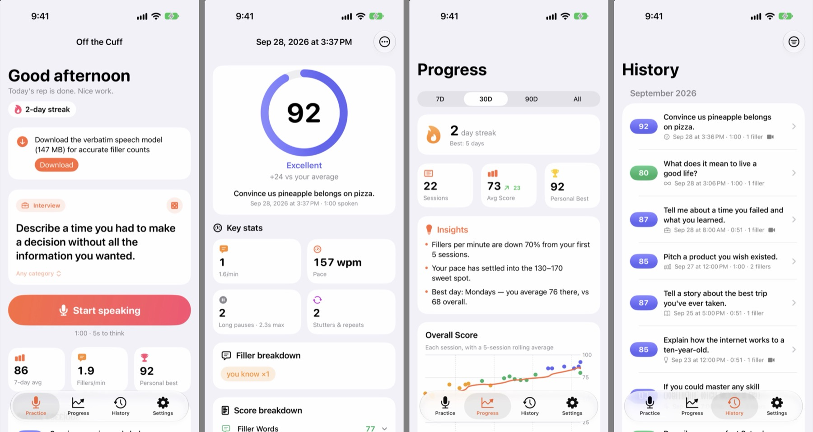
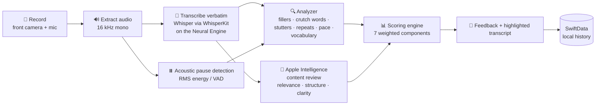

# Off the Cuff 🎙️

**A daily impromptu-speaking coach for iPhone.** Get a random topic, talk to the camera for one minute, and get an honest score on your filler words, stutters, pace, pauses, and content, all analyzed on-device, for free.



> One random topic. One minute. Every day.

---

## Why I built it

People post "1-minute impromptu speaking" challenges on social media to get better at interviews and thinking on their feet, but nobody actually **measures** anything. The apps that do score speech are mostly paid subscriptions, and most speech-to-text tools deliberately *delete* the "um"s and "uh"s you're trying to eliminate.

Off the Cuff turns the daily rep into something measurable: every attempt gets a transparent score, a highlighted transcript, and specific coaching, and your trend over weeks shows whether you're actually improving.

## Features

- **Random prompts:** 329 hand-written prompts across 9 categories (Interview, Opinion, Personal, Hypothetical, Explain It, Storytelling, Business & Tech, Big Ideas, Just for Fun), with recent-repeat avoidance and category filters.
- **Camera practice:** full-screen front-camera recording with a configurable think-time countdown, a live timer ring, haptics at 10 seconds left, and an audio-only mode.
- **Verbatim transcription:** every "um", "uh", "like", and stutter is kept, so it can be counted.
- **0–100 score** across 7 components: filler words, fluency, pace, pauses, time used, vocabulary, and content.
- **Highlighted transcript:** fillers in orange, crutch words in yellow, stutters and repeats in purple, and inline markers for long pauses.
- **AI coaching:** Apple Intelligence (on-device) grades relevance, structure, and clarity, lists strengths and improvements, and suggests a stronger opening line.
- **Rule-based feedback** that cites your actual numbers (for example: *"You said 'like' 5× — 6.2 fillers per minute. Most came in your first 15 seconds…"*).
- **Progress dashboard:** score trend with rolling average, fillers-per-minute chart, pace chart with a sweet-spot band, skill breakdown vs the previous period, most-common-fillers chart, a GitHub-style practice calendar, streaks, and auto-generated insights.
- **History:** every session with video/audio playback, search, category filters, sharing, and deletion.
- **Daily reminders**, CSV export, storage management, and a "How scoring works" page.
- **100% on-device:** no accounts, no servers, no API keys, no subscription.

## How it works



1. **Record:** `AVCaptureSession` records a 720p HEVC video with audio from the front camera.
2. **Extract audio:** `AVAssetReader` decodes the recording into 16 kHz mono float samples, the format Whisper expects.
3. **Transcribe verbatim:** OpenAI's open-source **Whisper** model runs on the iPhone's Neural Engine via [WhisperKit](https://github.com/argmaxinc/WhisperKit), with word-level timestamps. Whisper normally "cleans up" disfluencies, so the decoder is conditioned with a prompt that is itself full of fillers (*"Umm, let me think like, hmm… I- I think the the main thing is, you know…"*). The model mimics that style and keeps your "um"s. If the model isn't downloaded, Apple's `SFSpeechRecognizer` is used as a fallback.
4. **Detect pauses acoustically:** the analyzer computes RMS energy in 30 ms frames, finds an adaptive noise floor (10th vs 90th percentile), and measures real silences, which is more reliable than transcript word gaps.
5. **Tag every word:** a rule-based NLP pass classifies each word:
   - **Hard fillers:** um, uh, er, ah, hmm, plus elongated variants like "ummm".
   - **Context-dependent fillers:** "like" is a filler in *"it's, like, hard"* but not in *"I like pizza"* or *"it looks like rain"*. "You know", "I mean", "kind of", and "sort of" are handled the same way.
   - **Crutch words**, counted at half weight: basically, actually, literally, essentially, honestly…
   - **Stutters:** partial words ("th- the"), hyphenated repeats ("I-I"), and immediate repeats ("the the"), with exceptions for legitimate doubles like "that that" and "very very".
   - **Phrase repetitions:** restarts like *"I think, um, I think"*.
6. **Review content:** the transcript goes to Apple's on-device **Foundation Models** LLM with guided generation (`@Generable`), which returns structured scores and coaching.
7. **Score and store:** everything is combined into a 0–100 score and saved locally with SwiftData.

## The scoring algorithm

| Component | Weight | How it's scored |
|---|---|---|
| **Filler words** | 30% | `100 · e^(−0.10 · (fillers/min − 1))`, so ≤1 per minute is a perfect score. Crutch words count half. |
| **Fluency** | 15% | `100 · e^(−0.18 · (stutters+repeats/min − 0.5))` |
| **Pace** | 15% | 100 inside 130–170 WPM; −1.6 points per WPM outside the band |
| **Pauses** | 10% | Penalties per silence over 2 s (scaled by length) plus excess silence ratio above 20% |
| **Time used** | 10% | Full marks for using at least 90% of the time; linear down to 0 at 30% |
| **Vocabulary** | 5% | Moving-average type-token ratio (MATTR, 50-word window), piecewise-linear |
| **Content** | 15% | Apple Intelligence rating of relevance, structure, and clarity |

If Apple Intelligence isn't available, the other weights are re-normalized. Attempts under 25 words are capped at 40 so you can't game the score by barely speaking. Tiers: **Needs Work** (0–49), **Developing** (50–69), **Solid** (70–84), **Excellent** (85–100).

## Technical highlights

- **Getting a speech model to keep disfluencies.** Apple's speech APIs, including iOS 26's `SpeechTranscriber`, have no verbatim mode and strip filler words. Prompt-conditioning Whisper solved this. Tested on a synthetic clip, it kept 12 of 12 fillers and correctly transcribed a "hmm" that the unprompted model misheard as "um".
- **Hallucination guards.** Whisper can echo its prompt or loop on silence. The transcriber strips a leading echo only when four or more words match in sequence, so a real opening "Umm, let me…" survives, and it drops exact-duplicate looping segments.
- **Context-aware filler detection** without an ML model, via linguistic rules for verb vs comparison vs discourse uses, covered by 35 unit tests.
- **Acoustic voice-activity detection** with adaptive thresholds and short-blip bridging, falling back to word gaps when the audio has too little dynamic range.
- **On-device LLM with structured output.** Uses `@Generable` / `@Guide` for typed results, a 40 s timeout race via task groups, and a fresh `LanguageModelSession` per request so earlier transcripts never leak in or overflow the ~4K-token context.
- **Concurrency.** Capture runs on a dedicated serial queue, analysis runs off the main actor, and processing continues briefly in the background if you leave the app.
- **Resilience.** Sessions interrupted mid-analysis are recovered on relaunch with a Retry option. If the camera fails, you can continue in audio-only mode. A failed Whisper run falls back to Apple Speech.

## Tech stack

| Layer | Technology |
|---|---|
| UI | SwiftUI (iOS 18+, Liquid Glass on iOS 26+), Swift Charts |
| Storage | SwiftData, local file storage |
| Capture | AVFoundation (`AVCaptureSession`, `AVCaptureMovieFileOutput`, `AVAssetReader`) |
| Speech-to-text | [WhisperKit](https://github.com/argmaxinc/WhisperKit) (Whisper on Core ML / Neural Engine), Speech framework fallback |
| Signal processing | Custom RMS/VAD pause detector (Foundation / Accelerate) |
| AI coaching | Apple Foundation Models (on-device LLM, guided generation) |
| Notifications | UserNotifications (daily reminder) |
| Project / CI | XcodeGen, `xcodebuild`, XCTest, TestFlight |

## Project structure

```
Speak/
├── App/                 App entry, tab navigation
├── Models/              SwiftData model, analysis types, settings, stats
├── Design/              Theme, score ring, cards, shared components
├── Services/
│   ├── Recording/       Camera + mic capture, live preview
│   ├── Transcription/   Audio extraction, WhisperKit, Apple Speech fallback, model manager
│   ├── Analysis/        Filler / disfluency / pause detection, scoring, feedback
│   ├── AI/              Apple Intelligence content coach
│   ├── Pipeline/        End-to-end session processor
│   ├── Prompts/         329-prompt bank
│   ├── Notifications/   Daily reminder
│   └── Storage/         Recording + model file management
├── Features/            Practice, Progress, History, Settings, Onboarding screens
└── Resources/           Assets, privacy manifest
SpeakTests/              36 unit tests for the analysis + scoring engine
scripts/                 Build check and one-command TestFlight upload
```

About 8,600 lines of Swift across 50 files.

## Building it yourself

Requirements: Xcode 26+ (built with Xcode 27), [XcodeGen](https://github.com/yonaskolb/XcodeGen), and an iPhone running iOS 18+. Apple Intelligence features need an eligible device on iOS 26+.

```bash
git clone https://github.com/Ritvik-Bansal/off-the-cuff.git
cd off-the-cuff
# Set DEVELOPMENT_TEAM in project.yml to your own Apple Developer Team ID, then:
xcodegen generate
open Speak.xcodeproj
```

- Run on a real iPhone; the Simulator has no camera. The app downloads the Whisper model (147 MB) on first launch.
- `scripts/check.sh <name>` builds for the Simulator and prints only errors.
- `scripts/testflight.sh` archives and uploads a new TestFlight build.
- Debug builds accept `-demoData` (seeded sample history), `-startTab progress`, and `-showLatestReport` launch arguments for screenshots.

## Privacy

Everything stays on the device. Recordings, transcripts, and scores are stored locally and never uploaded. The only network request is the one-time speech model download from Hugging Face. No analytics, no tracking, no accounts.

## Credits

- [WhisperKit](https://github.com/argmaxinc/WhisperKit) by Argmax and [Whisper](https://github.com/openai/whisper) by OpenAI
- Built with [Claude Code](https://claude.com/claude-code), with multiple AI agents building the analysis engine, capture pipeline, and UI in parallel from a shared architecture.
